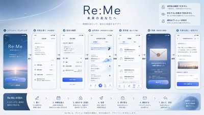

# Re:Me

> **未来のあなたへ**

Re:Me は、今の自分から未来の自分へ手紙を送り、時間をまたいで自分自身と会話するための、モバイルファースト Web アプリです。

## コンセプト

- 今の気持ち・判断・迷い・出来事を、分類せず自由な手紙として残す
- 届ける時期は「数日後くらい」「数週間後くらい」「数か月後くらい」などのざっくり指定、または「未来に任せる」
- 手紙は「封をする / 封をしない」を選べる
  - **封をする**: 到着して明示的に開封するまで自分でも本文を読めない
  - **封をしない**: 送信後も読み返せる
- 送信後の内容は編集できない
- 到着した手紙には返信でき、その返信もさらに未来へ送れる
- 返信を重ねることで、数年単位の「自分との会話」が一つのスレッドとして育つ

## プロダクト原則

1. **時間そのものを体験にする**
2. **分類しない** — 日記・ToDo・判断ログの型を押し付けない
3. **送信した瞬間を固定する** — 送信後は編集不可。ただし安全のため削除は可能
4. **内容を不用意に露出しない** — 通知に本文・写真を出さない
5. **機能より余白を優先する** — Re:Me の世界観に寄与しない機能は増やさない
6. **モバイルファースト** — 「ふと残したい瞬間」と「突然届く瞬間」をスマートフォン中心に設計する

## 基本フロー

```text
手紙を書く
  ↓
届ける時期を選ぶ
  ↓
封をする / しない
  ↓
未来へ送る
  ↓
未来を旅する
  ↓
到着通知
  ↓
開封する
  ↓
読む
  ↓
返信を書く
  ↓
返信も未来へ送る
```

## デザインリファレンス

実装時の主要な画面構成・遷移・トーン&マナーは、以下のモバイルファースト UI コンセプトを基準にします。



詳細は [デザインリファレンス](docs/design/README.md) と [UX / 画面遷移](docs/product/ux-flow.md) を参照してください。

## 技術スタック

- **Runtime**: Node.js 24 LTS
- **Package manager**: pnpm
- **Frontend**: React + TypeScript + Vite
- **Routing**: React Router
- **Server state**: Convex reactive query / mutation
- **UI**: Mantine + Re:Me custom design tokens / components
- **Toolchain**: Oxlint + Oxfmt + TypeScript (`tsc`)
- **Hosting**: Cloudflare Workers Static Assets + `@cloudflare/vite-plugin`
- **Auth**: Auth0 + Google OAuth
- **Backend / Database**: Convex functions + database + realtime
- **Image Storage**: private Cloudflare R2 via `@convex-dev/r2`
- **Delivery**: Convex Cron / Scheduler + internal mutations
- **Notification**: Web Push + Convex outbox
- **Test**: Vitest + React Testing Library + Playwright

詳細は [技術スタック](docs/architecture/tech-stack.md) を参照してください。

## セキュリティ上の主要設計

- `letters` metadata と `letter_contents` 本文を分離
- sealed letter は Convex authorization により、開封前の本人 client からも本文を取得不可
- exact `scheduledAt` は private delivery document に保存し、ユーザーには delivery window のみ公開
- 送信後編集不可を専用 mutation / function surface で強制
- Delivery と Notification を outbox で分離
- Auth0 / Convex / Cloudflare の secret は browser bundle へ公開しない

target backend の正本は `convex/schema.ts` と function validators に移行する。現行 `supabase/` は migration 実装が完了するまで残る legacy artifact です。

> 無料枠は MVP / 初期検証のために活用する。本番運用では、可用性・休止条件・容量・料金を再評価する。

## Environment 方針

環境ごとに provider resource を分離する。

- **Local / DEV**: Auth0 DEV tenant/application + Convex developer deployment + Vite/local Worker
- **Preview**: Auth0 DEV preview callback + Convex preview deployment + Cloudflare preview
- **Production**: Auth0 PROD tenant/application + Convex production deployment + Cloudflare production Worker
- **Google OAuth**: DEV client と production client を分離する

通常の自動 E2E は Google OAuth のログイン画面へ依存せず、Auth0 の database test identity で session を作る。Google OAuth の実連携は Auth0 callback から Convex authenticated query までを少数の smoke test で確認する。

## ドキュメント

### Product

- [プロダクトビジョン](docs/product/vision.md)
- [要件定義](docs/product/requirements.md)
- [UX / 画面遷移](docs/product/ux-flow.md)
- [MVP スコープ](docs/product/mvp.md)

### Architecture

- [アーキテクチャ概要](docs/architecture/overview.md)
- [技術スタック](docs/architecture/tech-stack.md)
- [プロジェクト構成](docs/architecture/project-structure.md)
- [データモデル](docs/architecture/data-model.md)
- [認証・セキュリティ](docs/architecture/auth-security.md)
- [手紙の配送・通知](docs/architecture/delivery-notifications.md)
- [ADR: Auth0 + Convex + Cloudflare](docs/architecture/decisions/0009-auth0-convex-cloudflare.md)
- [ADR: 送信後編集不可](docs/architecture/decisions/0002-immutable-letter.md)
- [ADR: ざっくり配送](docs/architecture/decisions/0003-delivery-window.md)
- [ADR: React / Vite / React Router](docs/architecture/decisions/0007-react-frontend-toolchain.md)
- [ADR: Mantine design system](docs/architecture/decisions/0008-mantine-design-system.md)
- [ADR: exact delivery time を private にする](docs/architecture/decisions/0006-private-exact-delivery-time.md)

### Implementation

- [移行前 Supabase baseline](supabase/README.md)
- [デザインリファレンス](docs/design/README.md)
- [開発ルール](AGENTS.md)

## ステータス

プロダクト要件・UX と Auth0 + Convex + Cloudflare の target architecture は確定済み。フロントエンドは React / Mantine、Auth0 + Convex の provider 骨格、DEV tenant / developer deployment の接続、E2E 用 Auth0 test identity まで入っています。domain schema、production 用 Google Cloud OAuth client、legacy Supabase runtime の撤去は後続です。
