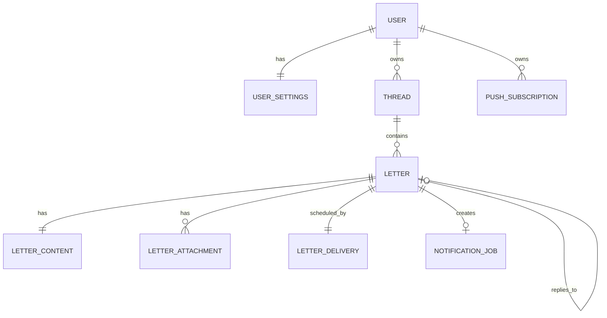

# データモデル

実装上の正本は `convex/schema.ts` と function validators とする。この文書は target model の設計意図を説明する。現行 `supabase/migrations/` は移行完了までの legacy source である。

## Model



## Core entities

### users

- `_id`
- `tokenIdentifier`（unique external identity lookup）
- safe profile fields
- `createdAt` / `updatedAt`

Domain ownership は `_id` を使い、Auth0 subject を各 table に直接保存しない。

### userSettings

- `userId`
- `timezone`
- `pushEnabled`
- `emailNotificationEnabled`

### threads

- `ownerId`
- `createdAt` / `updatedAt` / `deletedAt`

### letters

本文を除く metadata。

- `threadId`
- `ownerId`
- `parentLetterId`
- `nextLetterId`
- `status`: `draft | traveling | delivered`
- `sealed`
- `deliveryMode`
- `deliveryWindowStart` / `deliveryWindowEnd`
- `sentAt` / `deliveredAt` / `openedAt` / `repliedAt`
- `createdAt` / `updatedAt` / `deletedAt`

`opened` / `replied` は status に混ぜず timestamp とする。

### letterContents

- `letterId`
- `ownerId`
- `body`

metadata と body を分け、一覧 query が sealed body を読み込まない return shape を作る。

### letterAttachments

- `letterId`
- `ownerId`
- `kind`: `photo | location`
- `status`: `pending | ready | deleting`
- private R2 object id
- safe MIME / byte size / width / height
- display-only location label

正確な緯度経度と EXIF は恒久保存しない。

### attachmentFinalizationAttempts

- `attachmentId` / `generationToken`
- copy前に確定する一意なprivate R2 object key
- `state`: `claimed | winner | deleting`
- delete attempt / next reconciliation / sanitized error metadata

external copy直後のprocess停止でも候補keyを見失わず、winner以外を削除成功まで追跡する。

### letterDeliveries

- `letterId`
- `ownerId`
- `scheduledAt`
- delivery attempt / reconciliation metadata

`scheduledAt` は due index に使うが browser-facing query から返さない。

### notificationJobs

- `letterId`
- `ownerId`
- `status`: `pending | processing | sent | failed`
- `attemptCount`
- `generationToken`
- `availableAt` / `lockedAt` / `sentAt`
- sanitized `lastErrorCode`

Delivery と external notification を分離する outbox。

### pushSubscriptions

- `ownerId`
- endpoint / p256dh / auth
- created / updated / disabled metadata

## Required indexes

少なくとも以下の read path を index で支える。

- users by tokenIdentifier
- threads by ownerId and updatedAt
- letters by ownerId and status
- letters by threadId and sentAt
- letters by parentLetterId
- letterContents by letterId
- letterAttachments by letterId
- attachmentFinalizationAttempts by attachmentId
- attachmentFinalizationAttempts by state and nextReconcileAt
- letterDeliveries by delivery state and scheduledAt
- notificationJobs by status and availableAt
- pushSubscriptions by ownerId

Growing table を unbounded `.collect()` や `.filter()` で走査しない。list query は paginate / bounded `take` を使う。

## State transitions

```text
draft
  │ sendLetter
  ▼
traveling
  │ deliverDueLetters
  ▼
delivered
```

別軸:

```text
delivered
  │ openLetter
  ▼
openedAt != null
  │ reply を未来へ送信
  ▼
repliedAt != null
```

## Thread invariant

返信は同じ `threadId` に所属し、`parentLetterId` で直前の手紙を指す。MVP は一つの非削除 letter に次の非削除 letter を最大一通とする。

Convex に SQL partial unique index はないため、reply creation mutation 内で parent state を transactionally 検証し、parent に next letter id / `repliedAt` を記録して競合を OCC で拒否する。

## Immutable boundary

送信後は content / attachment / relationship / delivery setting を更新する public function を持たない。lifecycle metadata は専用 mutation / internal mutation だけが変更する。

## Public function surface

Authenticated client:

- `createDraft`
- `saveDraft`
- `getLetterMetadata`
- `listMyLetterMetadata`
- `listTravelingLetters`
- `getReadableContent`
- `sendLetter`
- `openLetter`
- `deleteLetter`
- `createAttachmentIntent`
- `attachmentActions.finalizeAttachment`

Internal only:

- `deliverDueLetters`
- `claimNotificationJobs`
- `completeNotificationJob`
- `reconcileAttachmentDeletion`

すべて args / return validator を持ち、private field を document ごと返さず明示的に map する。

## Schema evolution / migration

Convex schema change は populated deployment を前提に、optional field → backfill → required の順で行う。DEV → PROD の data copy を通常 workflow にせず、Production data migration は inventory、export、dry-run、rollback を別 task で設計する。
