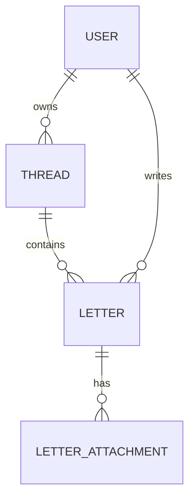

# データモデル

## Conceptual model



## Main entities

### Thread
- id
- user_id
- created_at
- updated_at

### Letter
- id
- user_id
- thread_id
- parent_letter_id
- body
- status
- sealed
- delivery_mode
- delivery_window_start
- delivery_window_end
- scheduled_at
- sent_at
- delivered_at
- opened_at
- created_at
- deleted_at

### LetterAttachment
- id
- letter_id
- type
- storage_key
- display_location
- created_at

## Letter status

```text
draft → traveling → delivered → opened → replied
```

削除状態は `deleted_at` で扱う案を第一候補とする。

## Important invariants

`status != draft` 後は body / attachment / sealed / delivery_mode / delivery_window / scheduled_at を変更不可とする。削除は例外として許可する。

`scheduled_at` は送信時に一度決定し、後からランダム再抽選しない。

返信は同じ `thread_id` に所属し、`parent_letter_id` で直前の手紙を指す。MVP では一つの Letter に複数の子 Letter を作らない。

## Attachments

写真本体は R2、DB には storage key と metadata を保存する。位置情報は地図用途ではなく記憶補助なので、正確な緯度経度を保存する必要性は別途判断する。
