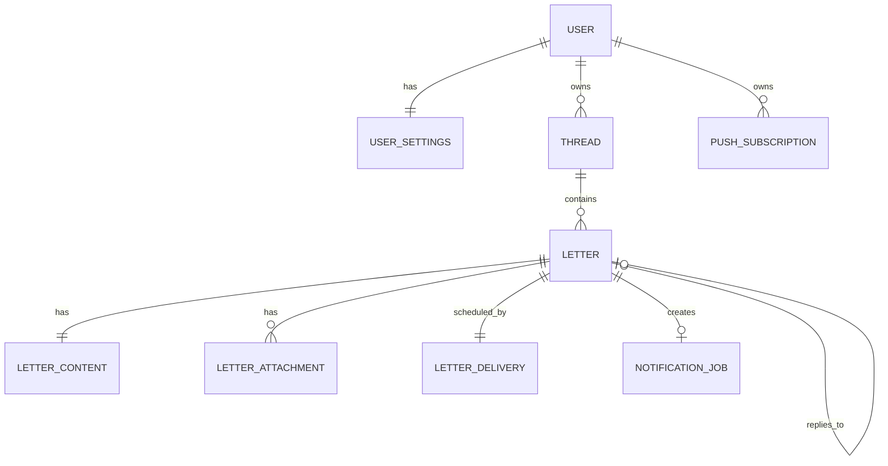

# データモデル

実装上の正本は `convex/schema.ts` と function validators とする。この文書は target model の設計意図を説明する。現行 `supabase/migrations/` は移行完了までの legacy ソースである。

## モデル



## 中核エンティティ

### users

- `_id`
- `tokenIdentifier`（一意な外部 identity 検索キー）
- 安全なプロフィール field
- `createdAt` / `updatedAt`

ドメインの所有権は `_id` を使い、Auth0 subject を各 table に直接保存しない。

### userSettings

- `userId`
- `timezone`
- `pushEnabled`
- `emailNotificationEnabled`

### threads

- `ownerId`
- `createdAt` / `updatedAt` / `deletedAt`

### letters

本文を除く metadata。

- `threadId`
- `ownerId`
- `parentLetterId`
- `nextLetterId`
- `status`: `draft | traveling | delivered`
- `sealed`
- `deliveryMode`
- `deliveryWindowStart` / `deliveryWindowEnd`
- `sentAt` / `deliveredAt` / `openedAt` / `repliedAt`
- `createdAt` / `updatedAt` / `deletedAt`

`opened` / `replied` は status に混ぜず timestamp とする。

### letterContents

- `letterId`
- `ownerId`
- `body`

metadata と本文を分け、一覧 query が封をした本文を読み込まない返り値にする。

### letterAttachments

- `letterId`
- `ownerId`
- `kind`: `photo | location`
- `status`: `pending | ready | deleting`
- 非公開 R2 object id
- 安全な MIME / byte size / width / height
- 表示専用の場所ラベル

正確な緯度経度と EXIF は恒久保存しない。

### attachmentFinalizationAttempts

- `attachmentId` / `generationToken`
- copy 前に確定する一意な非公開 R2 object key
- `state`: `claimed | winner | deleting`
- 削除試行 / 次回復旧 / 伏せたエラー metadata

外部 copy 直後に処理が止まっても候補 key を見失わず、winner 以外を削除成功まで追跡する。

### letterDeliveries

- `letterId`
- `ownerId`
- `scheduledAt`
- 配送試行 / 復旧 metadata

`scheduledAt` は due index に使うが、ブラウザ向け query からは返さない。

### notificationJobs

- `letterId`
- `ownerId`
- `status`: `pending | processing | sent | failed`
- `attemptCount`
- `generationToken`
- `availableAt` / `lockedAt` / `sentAt`
- 伏せた `lastErrorCode`

配送と外部通知を分ける outbox。

### pushSubscriptions

- `ownerId`
- endpoint / p256dh / auth
- 作成 / 更新 / 無効化 metadata

## 必須 indexes

少なくとも以下の読み取り経路を index で支える。

- users: tokenIdentifier
- threads: ownerId と updatedAt
- letters: ownerId と status
- letters: threadId と sentAt
- letters: parentLetterId
- letterContents: letterId
- letterAttachments: letterId
- attachmentFinalizationAttempts: attachmentId
- attachmentFinalizationAttempts: state と nextReconcileAt
- letterDeliveries: 配送状態と scheduledAt
- notificationJobs: status と availableAt
- pushSubscriptions: ownerId
- pushSubscriptions: ownerId と disabledAt

増える table を件数無制限の `.collect()` や `.filter()` で走査しない。一覧 query は paginate / 件数上限つき `take` を使う。

## 状態遷移

```text
draft
  │ sendLetter
  ▼
traveling
  │ deliverDueLetters
  ▼
delivered
```

別軸:

```text
delivered
  │ openLetter
  ▼
openedAt != null
  │ 返信を未来へ送信
  ▼
repliedAt != null
```

## スレッドの不変条件

返信は同じ `threadId` に所属し、`parentLetterId` で直前の手紙を指す。MVP は一つの未削除手紙に次の未削除手紙を最大一通とする。削除された手紙は thread 上で本文・写真・場所を出さないプレースホルダとして残す。

Convex に SQL の partial unique index はない。返信下書き作成 mutation 内で親の状態を transaction で検証し、親に `nextLetterId` を記録して競合を OCC で拒否する。`repliedAt` は返信を未来へ送ったときに記録する。

## 編集不可の境界

送信後は本文 / 添付 / 関係 / 配送設定を更新する public function を持たない。ライフサイクル metadata は専用 mutation / internal mutation だけが変更する。

## public function の面

認証済み client:

- `createDraft`
- `saveDraft`
- `getLetterMetadata`
- `listMyLetterMetadata`
- `listTravelingLetters`
- `getReadableContent`
- `sendLetter`
- `openLetter`
- `deleteLetter`
- `createAttachmentIntent`
- `attachmentActions.finalizeAttachment`

internal のみ:

- `deliverDueLetters`
- `claimNotificationJobs`
- `completeNotificationJob`
- `reconcileAttachmentDeletion`

すべて args / return validator を持ち、private field を document ごと返さず明示的に map する。

## schema 進化 / 移行

Convex の schema 変更はデータが入った deployment を前提に、optional field → backfill → required の順で行う。DEV → PROD の data コピーを通常作業にしない。Production data の移行は棚卸し、export、dry-run、rollback を別 task で設計する。
