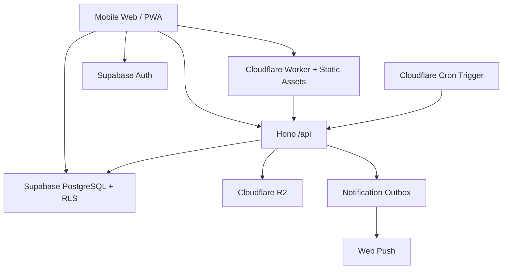

# アーキテクチャ概要

## 方針

Re:Me は、モバイルファースト Vue SPA と Cloudflare Worker を一つの Vite 開発体験にまとめ、Auth / DB は Supabase へ委譲する。



## Frontend

- Vue 3
- TypeScript
- Vite
- Vue Router
- PrimeVue + custom Re:Me design tokens
- Supabase JS client

詳細: [技術スタック](tech-stack.md) / [プロジェクト構成](project-structure.md)

## Cloudflare

新規アプリは Worker をデプロイ単位とする。

Worker の責務:

- SPA static assets
- Hono `/api/*`
- R2 photo upload / delete
- Supabase service role が必要な privileged operation
- scheduled handler
- delivery / notification jobs

`fetch` と `scheduled` を同じ Worker entry point から提供する。

## Supabase

責務:

- Social Login
- PostgreSQL
- RLS
- thread / letter / content / notification metadata
- trusted RPC

Browser から Supabase を直接利用する場合も RLS を前提とする。

## Trust boundary

### Browser から直接許可

- 自分の letter metadata SELECT
- RLS 上閲覧可能な本文 SELECT
- draft 本文 autosave
- draft attachment metadata の限定操作
- user settings
- push subscription

### Trusted RPC

- draft / thread 作成
- 送信
- 開封
- 削除

### Worker + Service Role

- exact schedule
- `traveling -> delivered`
- notification outbox
- R2 private object
- 管理・保守処理

## Exact delivery time

`scheduled_at` は public `letters` に保存しない。

```text
public.letters
  delivery_window_start/end  <- ユーザーが見てよい

private.letter_delivery
  scheduled_at               <- Worker / service role のみ
```

「数か月後くらい」という体験を API contract 自体で守る。

## Environments

初期:

- Local
- Production

利用者・変更リスクが増えたら Preview / Staging を追加する。

Supabase migration は environment ごとに同じ履歴を適用し、Dashboard の手変更を source of truth にしない。

## Free tier policy

無料枠は MVP 検証に利用するが、無料枠の制約をプロダクト仕様にしない。

Re:Me は長期間アクセスされないことが正常なので、公開前に以下を再確認する。

- DB / Auth の休止条件
- Cron / Worker limit
- R2 storage / operation limit
- 通知到達性
- バックアップ / 復旧
