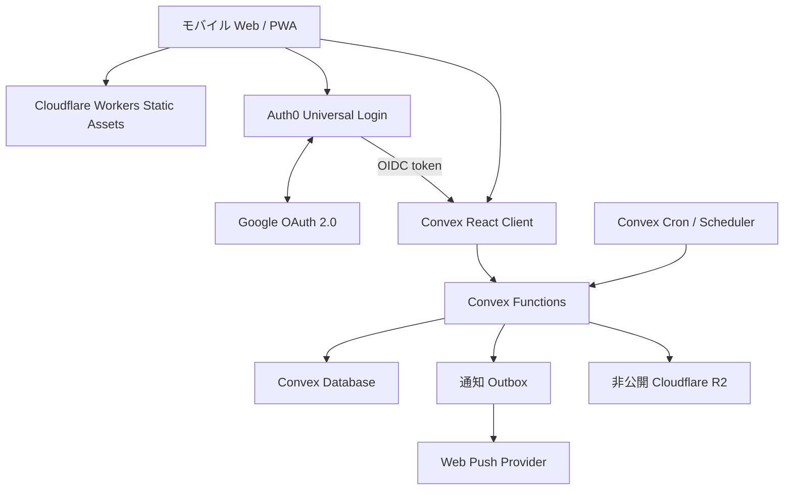

# アーキテクチャ概要

## 方針

Re:Me は Auth0 を identity provider、Convex を application backend、Cloudflare を frontend / edge platform とする。



## 責務の分担

| 基盤 | 持つもの | 持たないもの |
|---|---|---|
| Auth0 | Google OAuth、Universal Login、token / session、アカウントセキュリティ | 手紙の認可、ドメインデータ |
| Convex | schema、認可、query / mutation / action、realtime、scheduler、outbox | frontend hosting、identity credential の保管 |
| Cloudflare | React SPA / PWA 配信、CDN、custom domain、edge 保護、非公開 R2。移行後は D1 / Cron / Queues も担当 | Auth0 identity、domain authorization の正本 |

## フロントエンド

- React + TypeScript + Vite
- React Router
- Mantine + Re:Me 独自の design token / component
- `@auth0/auth0-react`
- `convex/react` + `convex/react-auth0`

React Router のガードは、未認証ユーザーを login へ案内する UX 境界に限る。ログイン済みかつ backend token が使えるかは `useConvexAuth()` を基準にし、ドメインの認可は必ず Convex function 内で行う。

Convex query は reactive cache を持つため、Convex data に TanStack Query を重ねない。Convex 以外の API が必要になった場合だけ、その API の責務を限定して再検討する。

## Auth0

- Google OAuth connection を MVP の login 手段とする
- Universal Login を使い、password / Google OAuth の credential を Re:Me が持たない
- DEV の E2E だけ Username-Password connection を使い、公開サインアップは無効にする
- SPA の callback / logout / web origin を環境ごとに許可リストする
- Auth0 が発行する token を Convex が issuer / audience / 署名まで検証する
- custom domain は DEV の必須条件にしない

## Convex

Convex は Re:Me の唯一の application backend とする。

- document schema と indexes
- public / internal の query、mutation、action
- ユーザー所有権と封をした本文の認可
- realtime 購読
- 正確な配送時刻と配送状態
- cron / scheduled functions
- 通知 outbox と retry 状態
- R2 object の metadata / アクセス意図

汎用 application API を Cloudflare Worker / Hono に複製しない。

## Cloudflare

Cloudflare Workers Static Assets で React SPA / PWA を配信する。SPA fallback、ハッシュ付き asset の cache、custom domain、CDN / WAF などの edge 機能を担当する。

写真本体は非公開 R2 に置く。`@convex-dev/r2` を認可境界として使い、bucket を公開しない。Worker に独自 upload API を足すのは target architecture に含めない。

## 信頼境界

### ブラウザ

- Auth0 の login / logout
- Convex public functions の呼び出し
- 認可後に発行された短命な R2 upload / download 権限の利用

ブラウザは以下を決定できない。

- 所有者の user id
- 正確な `scheduledAt`
- 配送 / 開封状態
- 通知 job の状態
- 封をした本文の可視性

### Convex の public functions

すべての public function は args / return validator を持つ。ログイン必須 function は Auth0 identity を内部 user id に解決し、対象 document の所有権と現在状態を検証する。

### Convex の internal functions

- 期限到来した手紙の配送
- 通知の claim / 完了 / retry
- 掃除 / 復旧
- 外部副作用の前後の状態遷移

scheduled function にはブラウザの認証文脈が伝わらない。internal id と期待する状態を引数にし、実行時に再検証する。

## データのプライバシー境界

```text
letters              metadata / 配送レンジ / ライフサイクル
letterContents       本文
letterAttachments    R2 storage id / 安全な metadata
letterDeliveries     正確な scheduledAt（client の返り値から除外）
notificationJobs     push outbox / retry
```

封をした手紙の本文と添付は、到着後に本人が明示的に開封するまで public query から返さない。これは E2EE ではなく、アプリケーション層のアクセス制御である。

## 環境モデル

| 環境 | Auth0 | Convex | Cloudflare |
|---|---|---|---|
| Local | DEV tenant / SPA / Google OAuth client | マシン上の local backend | Vite + local Worker runtime |
| Preview / CI E2E | DEV tenant の固定 Preview callback | 共有 preview deployment | 固定 `workers.dev` Preview URL（E2E 自体は CI 上の Vite preview） |
| Production | PROD tenant / SPA / Google OAuth client | production deployment | production Worker / domain |

環境間で secret、deployment URL、OAuth client を共有しない。Production 操作や data migration は別 task と Human Gate を必要とする。

Convex の接続先は次で固定する。詳細手順は [Local / Preview 環境](../development/preview-environment.md) を正とする。

| 場所 | Convex | 無料枠 |
|---|---|---|
| 日常の local 開発 | マシン上の local backend（`pnpm convex:dev` / `pnpm dev:full`） | 乗らない |
| `pnpm test:convex` / CI 品質ゲート | in-memory の `convex-test` | 乗らない |
| CI E2E | 共有 Preview へ `convex deploy` してから Playwright | Preview の remote を使う |
| 共有 Preview Worker | 同じ Preview deployment（手動 `preview.yml`） | Preview の remote を使う |
| Production | production deployment。local / PR CI からは触らない | 本番課金 |

## 移行状況

この文書は target architecture の正本である。repository の current runtime は Auth0 + Convex + Cloudflare Workers Static Assets。通常 E2E は Auth0 の database test identity を使い、人が触る login 入口は Google のままにする。legacy `supabase/migrations/` は production data の移行まで比較用に残す。

Issue #60 の foundation として、D1 schema、環境別 D1 / R2 / Queue / Cron binding、Convex export の dry-run / idempotent SQL / rollback artifact を追加した。API / frontend の cutover が完了するまで application backend の正本は Convex のままや。production 用 resource 作成、export、R2 copy、D1 import、traffic cutover、Convex cleanup は別 Human Gate の対象や。手順は [Convex → D1 移行リハーサル](../development/convex-d1-migration.md) と [ADR-0010](decisions/0010-cloudflare-d1-migration-foundation.md) を参照する。

## 参照

- [ADR-0009](decisions/0009-auth0-convex-cloudflare.md)
- [技術スタック](tech-stack.md)
- [認証・セキュリティ](auth-security.md)
- [データモデル](data-model.md)
- [手紙の配送・通知](delivery-notifications.md)
