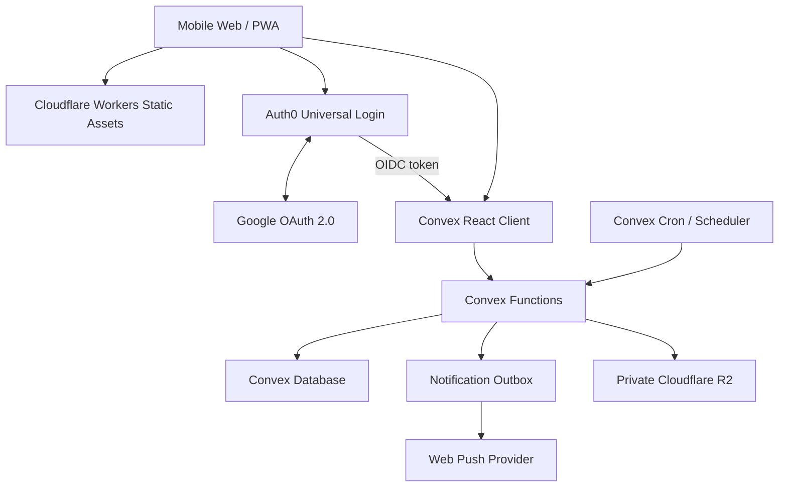

# アーキテクチャ概要

## 方針

Re:Me は Auth0 を identity provider、Convex を application backend、Cloudflare を frontend / edge platform とする。



## Responsibility map

| Platform | Owns | Does not own |
|---|---|---|
| Auth0 | Google OAuth、Universal Login、token / session、account security | letter authorization、domain data |
| Convex | schema、authorization、queries / mutations / actions、realtime、scheduler、outbox | frontend hosting、identity credential storage |
| Cloudflare | React SPA / PWA 配信、CDN、custom domain、edge protection、private R2 | application database、delivery state machine |

## Frontend

- React + TypeScript + Vite
- React Router
- Mantine + Re:Me custom design tokens / components
- `@auth0/auth0-react`
- `convex/react` + `convex/react-auth0`

React Router の guard は未認証 user を login へ案内する UX 境界に限る。ログイン済みかつ backend token が利用可能かは `useConvexAuth()` を基準にし、domain authorization は必ず Convex function 内で行う。

Convex query は reactive cache を持つため、Convex data に TanStack Query を重ねない。非 Convex API が必要になった場合だけ、その API の責務を限定して再検討する。

## Auth0

- Google OAuth connection を MVP の login method とする
- Universal Login を使い、password / Google OAuth credential を Re:Me が保持しない
- SPA callback / logout / web origin を environment ごとに allowlist する
- Auth0 が発行する token を Convex が issuer / audience / signature まで検証する
- custom domain は DEV の必須条件にしない

## Convex

Convex は Re:Me の唯一の application backend とする。

- document schema と indexes
- public / internal query、mutation、action
- user ownership と sealed content の authorization
- realtime subscriptions
- exact delivery time と delivery state
- cron / scheduled functions
- notification outbox と retry state
- R2 object metadata / access intent

汎用 application API を Cloudflare Worker / Hono に複製しない。

## Cloudflare

Cloudflare Workers Static Assets で React SPA / PWA を配信する。SPA fallback、hashed asset cache、custom domain、CDN / WAF 等の edge 機能を担当する。

写真本体は private R2 に置く。`@convex-dev/r2` を認可境界として使い、bucket を public にしない。Worker に独自 upload API を追加するのは target architecture に含めない。

## Trust boundary

### Browser

- Auth0 login / logout
- Convex public functions の呼び出し
- 認可後に発行された短命な R2 upload / download capability の利用

Browser は以下を決定できない。

- owner user id
- exact `scheduledAt`
- delivery / opened state
- notification job state
- sealed content の可視性

### Convex public functions

すべての public function は args / return validator を持つ。ログイン必須 function は Auth0 identity を internal user id に解決し、対象 document の ownership と現在 state を検証する。

### Convex internal functions

- due letter delivery
- notification claim / completion / retry
- cleanup / reconciliation
- external side effect 前後の state transition

scheduled function には browser の auth context が伝播しないため、internal id と expected state を引数にし、実行時に再検証する。

## Data privacy boundary

```text
letters              metadata / window / lifecycle
letterContents       body
letterAttachments    R2 storage id / safe metadata
letterDeliveries     exact scheduledAt（client return から除外）
notificationJobs     push outbox / retry
```

sealed letter の本文と添付は、到着後に本人が明示的に開封するまで public query から返さない。これは E2EE ではなく application-level access control である。

## Environment model

| Environment | Auth0 | Convex | Cloudflare |
|---|---|---|---|
| Local / developer | DEV tenant / SPA / Google OAuth client | developer deployment | Vite + local Worker runtime |
| Preview | DEV tenant の preview callback | preview deployment | preview URL |
| Production | PROD tenant / SPA / Google OAuth client | production deployment | production Worker / domain |

環境間で secret、deployment URL、OAuth client を共有しない。Production 操作や data migration は別 task と Human Gate を必要とする。

## Migration status

この文書は target architecture の正本である。現行 repository には Supabase / Hono / TanStack Query ベースの migration code と dependency が残っており、まだ runtime は移行完了していない。移行順序は [Implementation order](../development/implementation-order.md) と [ADR-0009](decisions/0009-auth0-convex-cloudflare.md) を参照する。

## References

- [ADR-0009](decisions/0009-auth0-convex-cloudflare.md)
- [Tech stack](tech-stack.md)
- [Auth / security](auth-security.md)
- [Data model](data-model.md)
- [Delivery / notifications](delivery-notifications.md)
