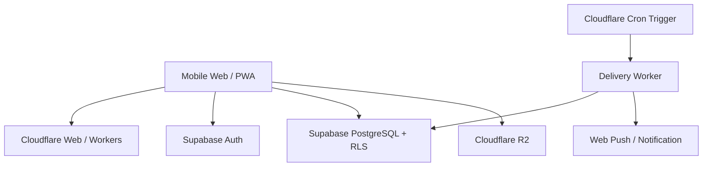

# アーキテクチャ概要

## 方針

MVP は運用コストを抑えつつ、認証・DB の安全性を自前実装しすぎない構成とする。

## Responsibility

### Cloudflare
- Web アプリ配信
- Worker API / BFF が必要な処理
- 配送スケジューラ
- 到着処理
- Push 通知
- 写真ストレージ（R2）

### Supabase
- Auth
- PostgreSQL
- RLS
- User / Thread / Letter / Delivery state の永続化

## Trust boundary

RLS が十分に設計できる通常 CRUD は Browser → Supabase を許容する。

信頼境界を超える処理は Worker 側に寄せる。

- `traveling -> delivered`
- 到着時刻の決定
- Push 通知
- 管理処理
- Service Role が必要な操作

## Environments

最低限 Local / Production。利用者と変更リスクが増えた時点で Preview / Staging を追加検討する。

## Free tier policy

無料枠は MVP 検証のための制約として使うが、プロダクト仕様の前提にはしない。長期間アクセスされないことが正常な Re:Me では、自動休止・可用性条件が UX と衝突しないか本番公開前に再確認する。
