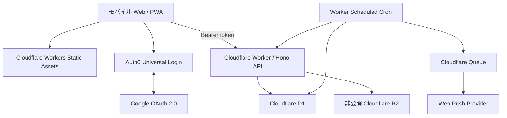

# アーキテクチャ概要

## 方針

Re:Me は Auth0 を identity provider、Cloudflare Worker を application
backend、D1 / R2 / Queues を永続化・非同期処理基盤とする。Preview はこの構成へ
移行済みで、現在の repository に別 backend の実行経路は持たない。



## 責務の分担

| 基盤 | 持つもの | 持たないもの |
|---|---|---|
| Auth0 | Google OAuth、Universal Login、token / session | 手紙の所有権、ドメインデータ |
| Worker / Hono | JWT 検証、認可、API、状態遷移、R2 capability、scheduled 処理 | identity credential の保管、公開 object |
| D1 | ユーザー、手紙、本文、添付 metadata、配送・通知 outbox | 写真本体、ブラウザ向けの秘密時刻 |
| R2 | 非公開の写真 object | 公開 URL、認可判断 |
| Queues | 通知ジョブの非同期実行 | 手紙の到着状態そのもの |
| Static Assets | React SPA / PWA の配信 | API の認可 |

## フロントエンド

- React + TypeScript + Vite
- React Router
- Mantine + Re:Me 独自 design token / component
- `@auth0/auth0-react`
- `@tanstack/react-query` と `src/shared/api/client.ts`

React Router のガードは未認証ユーザーを login へ案内する UX 境界に限る。ドメイン
データの認証・認可は毎回 Worker API が JWT と D1 の所有権を検証する。

## Auth0

- Google OAuth connection と Universal Login を使う
- Re:Me は Google の password / OAuth credential を保持しない
- DEV / Preview と Production の tenant、application、OAuth client、callback URL
  は分離する
- Auth0 の public な browser 設定と Worker secret を混同しない

## Worker

Worker は browser API と scheduled / queue handler の両方を持つ。重要な状態遷移は
専用の domain function と D1 transaction で行い、generic patch API は公開しない。

- 認証済みユーザーを Auth0 `sub` から D1 `users` へ解決する
- 所有権、draft / traveling / delivered、封、開封、削除状態を server-side で検証する
- 手紙の到着と通知送信を別状態として扱う
- scheduled sweep と Queue consumer を冪等にする

## データのプライバシー境界

```text
letters              metadata / 配送レンジ / ライフサイクル
letter_contents      本文
letter_attachments   R2 object key / 安全な metadata
letter_deliveries    正確な scheduled_at（browser response へ含めない）
notification_jobs    push outbox / retry
```

封をした手紙の本文と添付は、到着後に本人が明示的に開封するまで API が返さない。
これは E2EE ではなく、アプリケーション層のアクセス制御である。

## 環境モデル

| 環境 | Auth0 | Cloudflare |
|---|---|---|
| Local | DEV tenant / SPA | local Worker、D1、R2、Queue |
| Preview / CI E2E | DEV tenant の固定 Preview callback | `re-me-preview` Worker、D1、R2、Queue |
| Production | PROD tenant / SPA（未構築） | `re-me` Worker、D1、R2、Queue（未デプロイ） |

環境間で secret、database、bucket、queue、deployment URL を共有しない。Production
はまだユーザー・業務データを投入していないため、初回構築・データ投入・traffic
切替は別 task と Human Gate で扱う。

## 移行・撤去状況

- Preview の runtime cutover は完了している
- Production は未デプロイで、移行対象となる本番データは存在しない
- repository から旧 backend の source、client、scheduler、依存、CI job、migration
  CLI を削除した
- D1 の `0003_remove_legacy_import_bookkeeping.sql` で一時的な import bookkeeping
  も撤去する
- 既存の外部 Preview deployment の停止は、対象を確認したうえで行う別の service
  operation とし、Production 資源は削除しない

この判断の記録は [ADR-0012](decisions/0012-cloudflare-only-preview-runtime.md) に
置く。

## 参照

- [技術スタック](tech-stack.md)
- [認証・セキュリティ](auth-security.md)
- [データモデル](data-model.md)
- [手紙の配送・通知](delivery-notifications.md)
- [ADR-0012](decisions/0012-cloudflare-only-preview-runtime.md)
