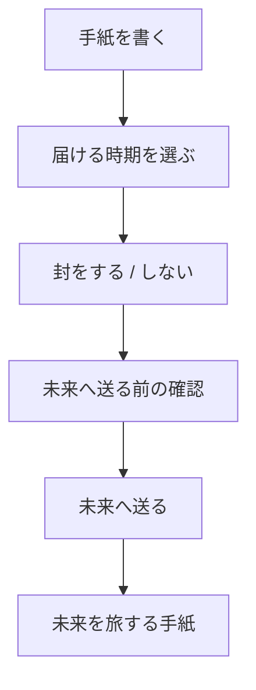
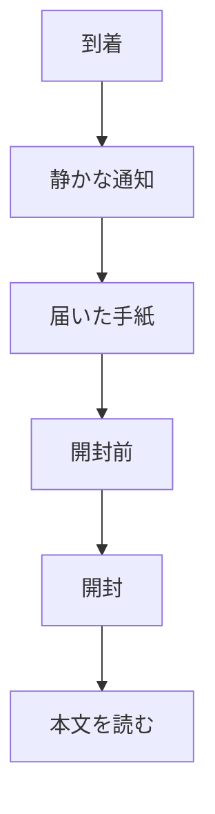
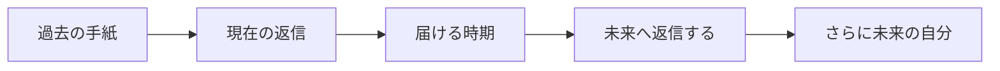

# UX / 画面遷移

## Visual reference

以下の画像を、MVP の主要画面・画面遷移・モバイルファースト UI の実装リファレンスとする。


画像は完成仕様そのものではなく、本文書の要件と合わせて解釈する。画像内の文言やナビゲーションと本文書が競合する場合は、本文書の確定要件を優先し、画像のトーン・情報密度・体験の方向性を参照する。

## Navigation

MVP の主要ナビゲーションは 3 つを基本とする。

```text
[ 届いた手紙 ]   [ ＋ 書く ]   [ 旅する手紙 ]
```

ホーム専用画面は作らず、「届いた手紙」を起点にする案を優先する。設定・アカウントはヘッダー等から遷移する。

## Flow A: 新しい手紙を送る



### 手紙を書く
本文を書くことを主役にする。本文、写真（任意）、位置情報（任意）、次へ。タイトル・カテゴリ・タグ・気分スコアは置かない。

### 届ける時期
- 数日後くらい
- 数週間後くらい
- 数か月後くらい
- 1年後くらい
- 未来に任せる

### 封
**封をする**: 「届くまで、あなたも読むことができません。」

**封をしない**: 「送ったあとも、いつでも読み返せます。」

### 送信の儀式
「保存」ではなく、未来へ送り出す体験にする。封筒が閉じる / 封が押される程度の短い演出を検討する。

## Flow B: 到着した手紙を読む



通知例:

> Re:Me  
> あなた宛ての手紙が届いています。

受信箱では「184日前のあなたから」「今日届きました」など経過時間を主役にする。

封をした手紙だけ、本文前に「開封する」画面を置く。「あとで開封する」も許容する。

## Flow C: 返信する



返信も現在時点のログとして完結させず、次の未来へ送る。スレッドは一本道を基本とする。

## UX vocabulary

避けたい表現: 配送の確認 / 発送 / 配送完了

優先したい表現: 未来へ送る / 未来を旅する手紙 / 届いた手紙 / 開封する / 未来へ返信する
